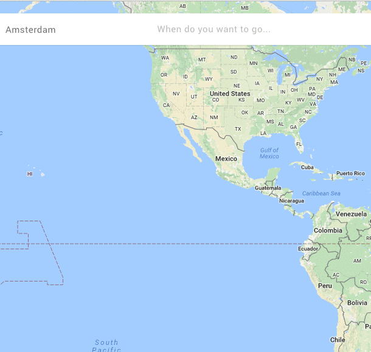

# react-waitforanimation

When you need to do UI blocking work after an animation, it results in a better user experience
when you finish the animation first and THEN do the blocking work.

Note this is probably only for specific use-cases and only works with CSS animations. Also `requestIdleCallback`
is the best solution for this, but is poorly supported :(

## How?

For now check the example. 

```
componentDidUpdate(prevProps) {
  const { animationDidFinish } = this.props;
  if (animationDidFinish && animationDidFinish !== prevProps.animationDidFinish) {
    this.someBlockingAction();
  }
}
```


